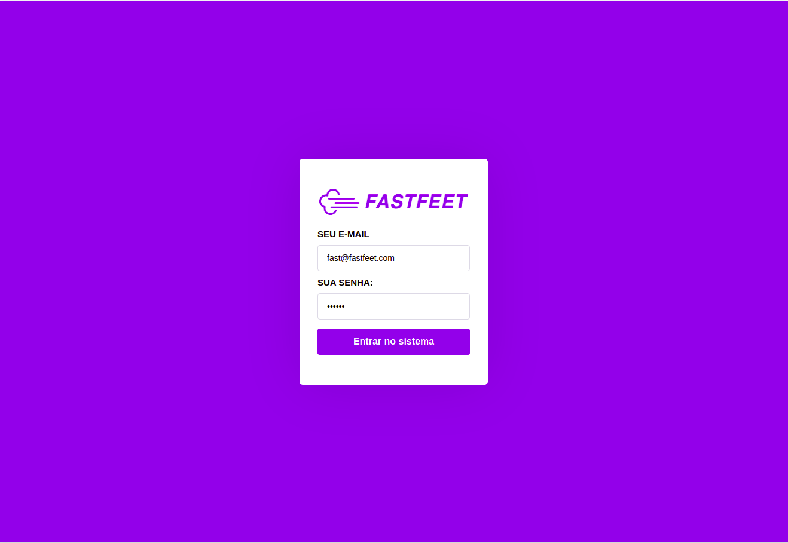
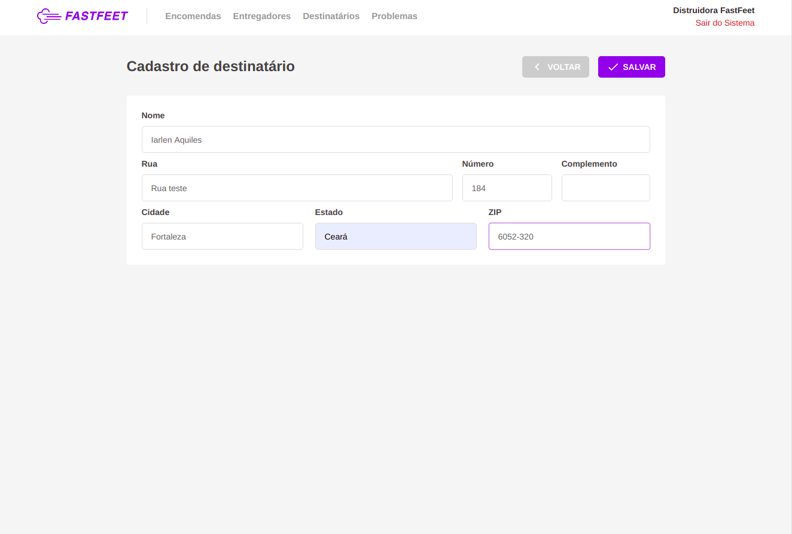
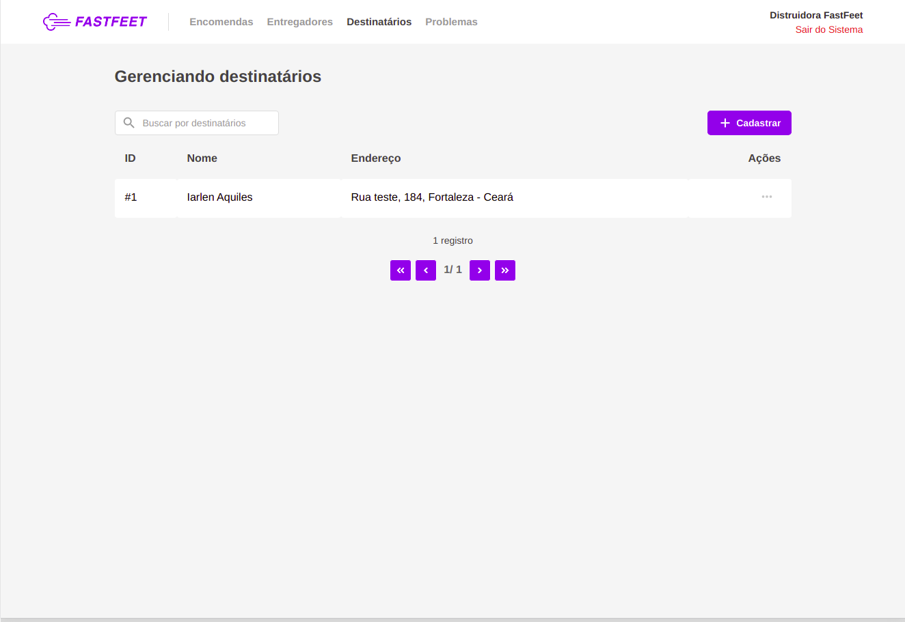
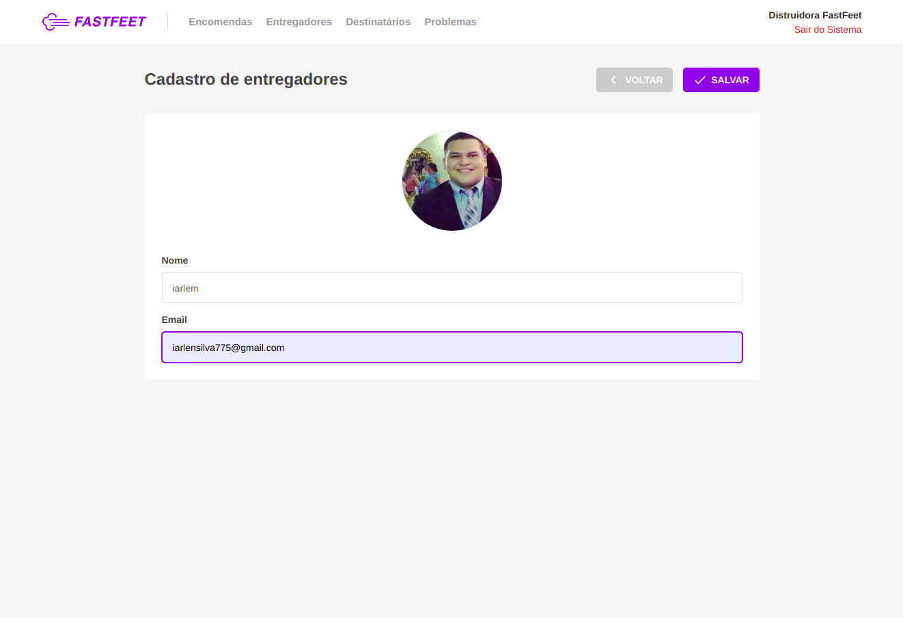
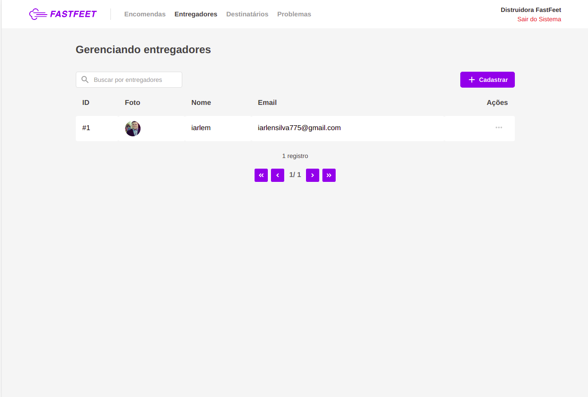
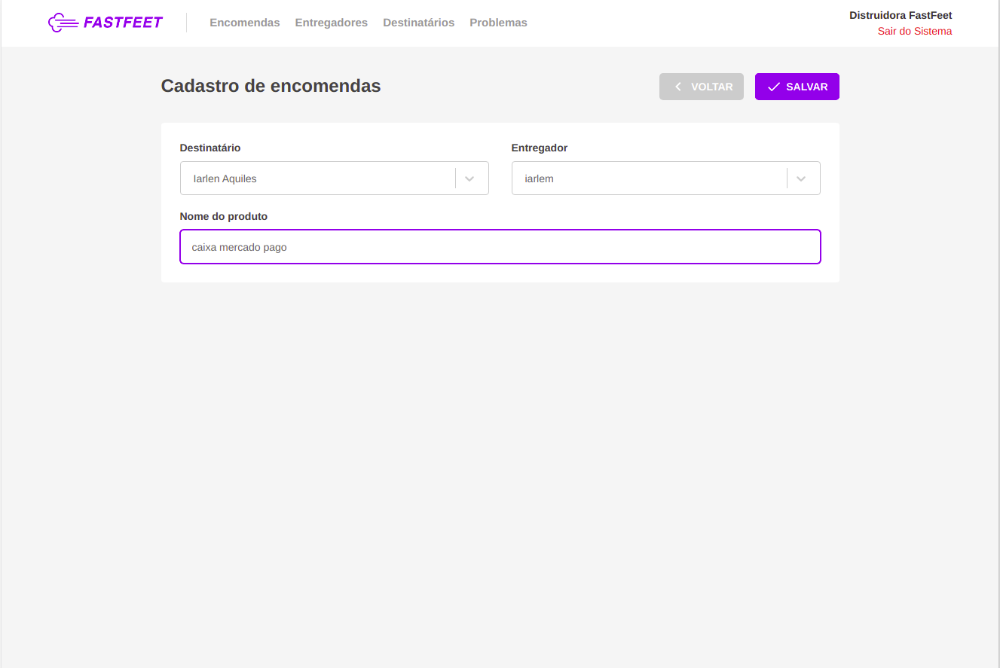
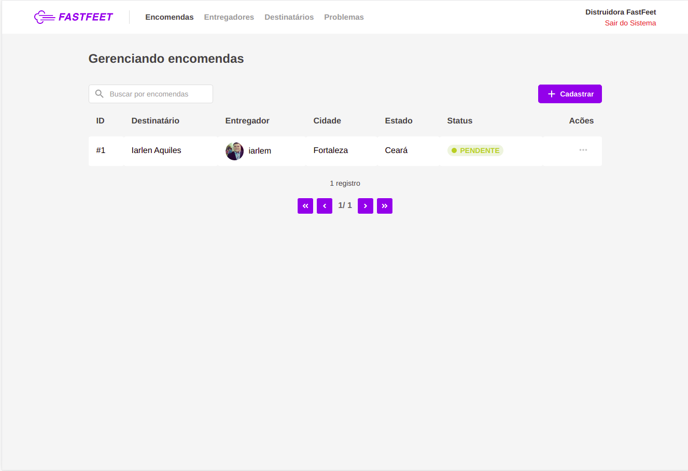
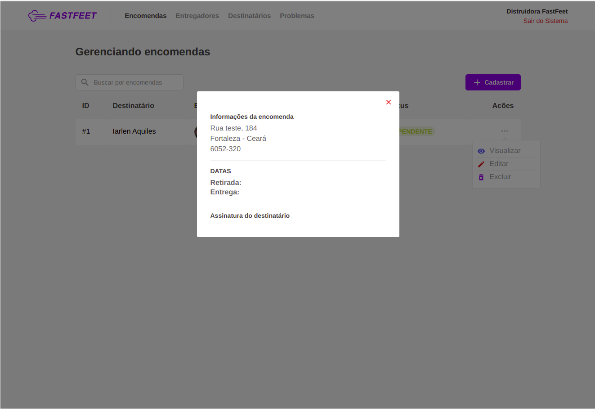

<h1 align="center">
  
</h1>

# :computer: Aplicação Web em ReactJS para gerenciar o delivery de produtos/mercadorias

## Tecnologias

- Axios
- History
- Immer
- Polished
- PropTypes
- Redux
- Redux Saga
- React Toastify
- Reactotron
- Styled Components
- Yup
- ESLint
- Prettier

## Run

- git clone
- yarn
- yarn start
